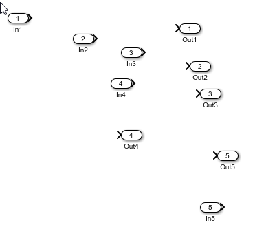
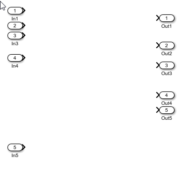

# Simulink Personal Toolchain

Simulink Tools to improve model quality and decrease modeling time.

Simulink Tools is also used to meet corporate modeling requirements.


## [```alignIO.m```](alignIO.m)

Requirement: 

- In ports **shall** all be aligned on the left hand side of the model.
- Out ports **shall** all be aligned on the right hand side of the model.

**Before**: 


**After**:



## [```closeSubSystems.m```](closeSubSystems.m)

Requirement:

- Models **shall** have no open subsystems when opened.
- Models **shall** open to the top level model.

When a model is saved Simulink remembers the opened subsystems. This can lead to an inconsistent user experience with multiple developers on a model. ```closeSubSystems.m``` closes all subsystems and re-saves the model.

## [```deHighlight.m```](deHighlight.m)

Requirements:

- Blocks **shall** have no additional foreground colors other than the sample time colors.  
- Signal lines **shall** have no additional foreground colors other than the sample time colors.

Simulink will highlight systems when there is an error or to trace a signal. This can lead to confusion when displaying sample time colors. ```deHighlight.m``` removes all additional highlighting 


## [```fixedSetup.m```](fixedSetup.m)

Requirements: None

Usage: Creating a fixed point model for doing sandbox development.

```
set_param(model,'BufferReuse','off')
set_param(model,'SolverName','FixedStepDiscrete')
set_param(model,'FixedStep','0.015')
set_param(model,'StopTime','1.5');
set_param(model,'SaveTime','off')
set_param(model,'SaveOutput','off')
set_param(model,'LimitDataPoints','off')
set_param(model,'BlockReductionOpt','off')
```

## [```newprob.m```](newprob.m)

Requirements: None

Usage: Reset Matlab to a 'startup' state without having to restart Matlab.

- Remove all paths from the Project Folder. (User is prompted for Project Folder if none is currently saved)
- Clear java paths.
- Close all figures
- Close all models.
- Close all open files.
- Clear all variables.
- Load Simulink.
- Clear the screen.

## [```simulinkDisplay.m```](simulinkDisplay.m)

```simulinkDisplay.m``` enforces modeling guidelines.

Requirements:

- Models **shall** have wide lines enabled.
  [Draws lines that carry vector or matrix signals wider than lines that carry scalar signals.]
- Models **shall** display port data types
  [Show data types of ports on this model's block diagram.]
- Models **shall** display signal storage classes.
  [Show storage classes of signals on this model's block diagram.]
- Models **shall** display signal line dimensions.
  [Show signal dimensions on this model's block diagram.]
- Models **shall** have sample time colors enabled.


- Models **shall** have sample time annotations enabled.

## [```unitDelayPrettify.m```](unitDelayPrettify.m)

Requirement: Unit delays **shall** be right aligned with their source block.

**Before**:


**After**:
